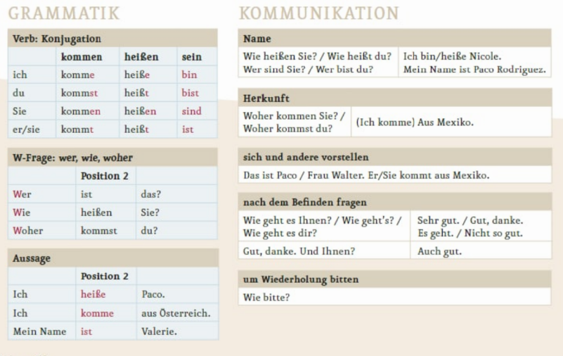

🏷️Tags: #rules, #Regeln

Related:
- [01 Sätze - phrases](01%20Sätze%20-%20phrases.md)

# Artikel / articles

#derDieDas

| Artikel / article | Geschlecht / gender |
|-------------------|---------------------|
| der (männlich)    | masculine           |
| die (feminin)     | feminine            |
| das (neutral)     | neutral             |

## Comparing to English

English does not have such articles, in English language you can only find (`the` **and** `a/an`):
- `the` - definite article
- `a/dn` - indefinite article

> Note: 
> Each table with nouns (Substantive) will start with der die das columns (for easy of use)

> [!todo]+
> 
>Related:
> - [02 ein, eine, kein, keine](../02%20Angaben%20zur%20Person,%20Berufe%20-%20Personal%20details,%20professions/02%20ein,%20eine,%20kein,%20keine.md)
> - [[00N ein, eine, einen, kein, keine, keinen]]

# Personalpronomen - personal pronouns

ich (I)
du (you)
er (he) / sie (she) /es (it)

wir (we)
<mark class="hltr-yellow">ihr (you guys)</mark> 
sie (they) / Sie (You)

> 👧♀sie — she | Herr — Mr.
> 👦♂er — he | Frau — Ms.

# Präsens - present

🇺🇸Conjugation — 🇩🇪Konjugation — rus Спряжение

- mach`en` — infinitive (base form)
- remove `en` for **I**  — (**Ich**) mach`e` meine Hausaufgaben

Getting the stem of a word `machen`:
- mach — Wrotstamm — stem

> ⭐️Note:
regelmäßige / schwache Verben (regular/weak verbs)
unregelmäßige / starke Verben (irregular / stong verbs) ~=🇩🇪200; and 🇺🇸~=283

# Verbbildung-verb-formation
- - Woher komm`st` `du`? Where do you come from?
- `Ich` komm`e` aus Ukraine. I'm from Ukraine.

| pronoun            | ending |
|--------------------|--------|
| ich                | e      |
| er / sie / es      | t      |
| ihr                | t      |
| wir                | en     |
| sie (they) Sie (u) | en     |
| du                 | st     |

> heißen
- sein       heissen     kommen
- ich —                           e       bin        heisse        komme
- du —                            st      bist        heisst        kommst
- er / sie / es —             t        ist          heisst         kommt
- wir —                           en     sind      heissen      kommen   
- ihr —                            t        seid      heisst         kommt
- sie (they) Sie (u) —    en     sind       heissen     kommen

# Countries with article

|   Article | Country |
|----------:|---------|
|       aus | Spanien |
| aus `der` | Ukraine |
| aus `der` | Turkei  |
| aus `der` | Schweiz |
| aus `dem` | Iran    |

Zum Beispiel(zum z.B., beispielsweise):
> Ich bin aus der Ukraine

# Das ist / This is

Zum Beispiel:
> Das ist Arthur - This is Arthur
> Das ist mein Buch - This is my book

