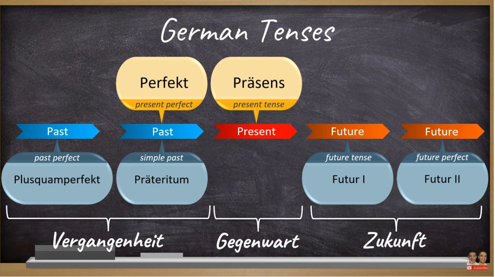

# Tenses in German

## There are only 6 of them
1. Past perfect — Plusquamperfekt
2. Past simple — Präteritum
3. Present Perfect — Perfekt
4. Present — Präsens
5. Future time — Future I
6. Future perfect — Future II